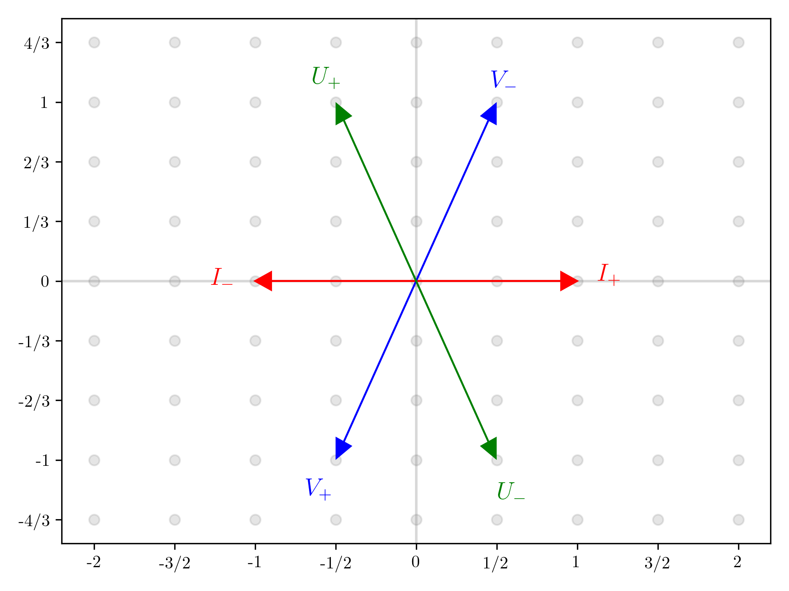
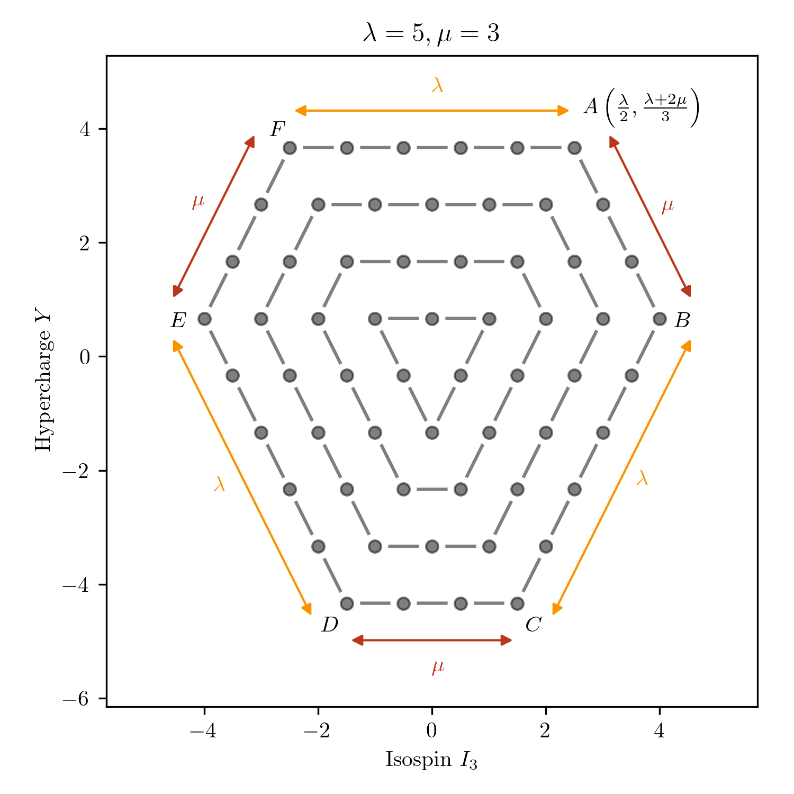
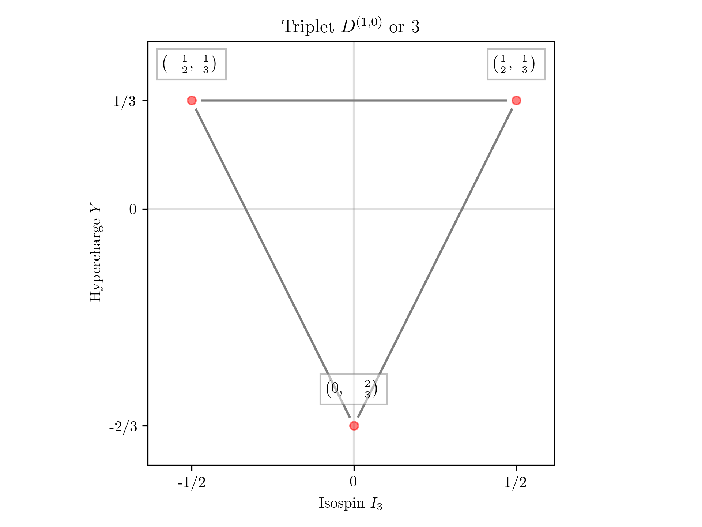
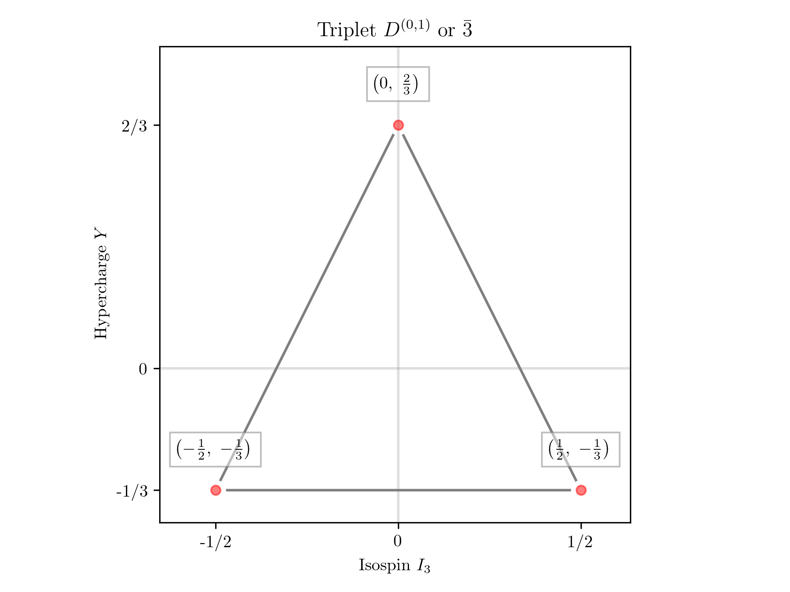
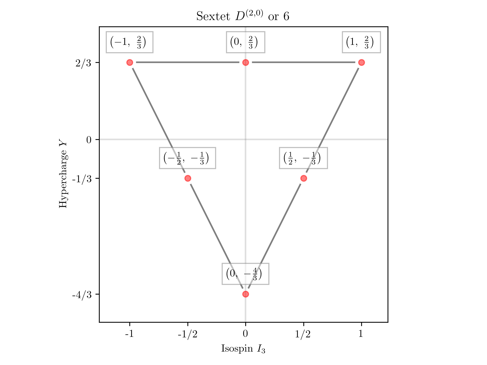
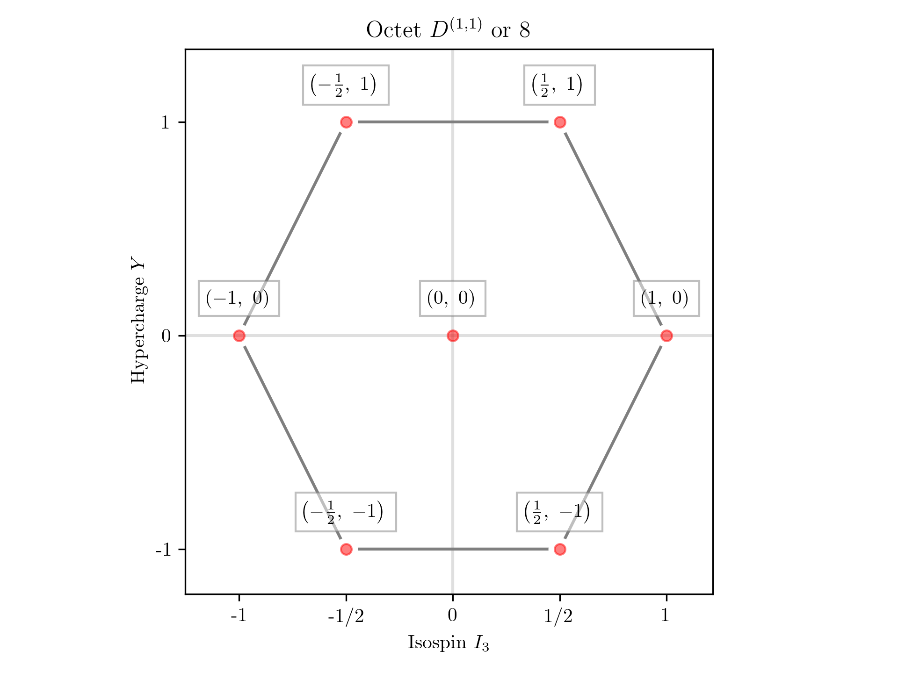
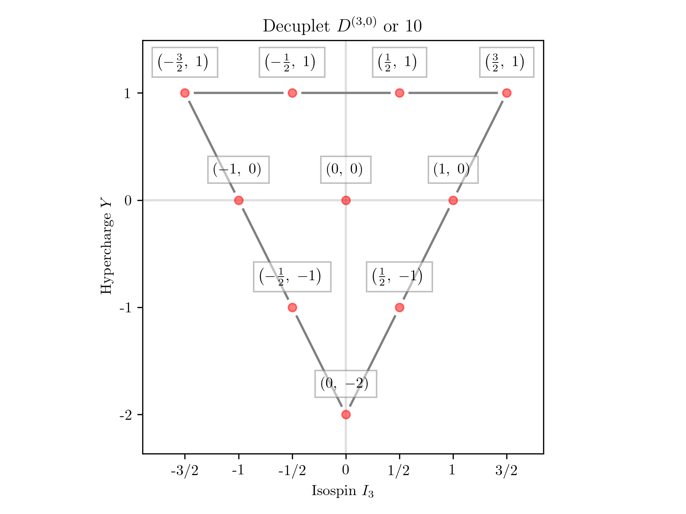
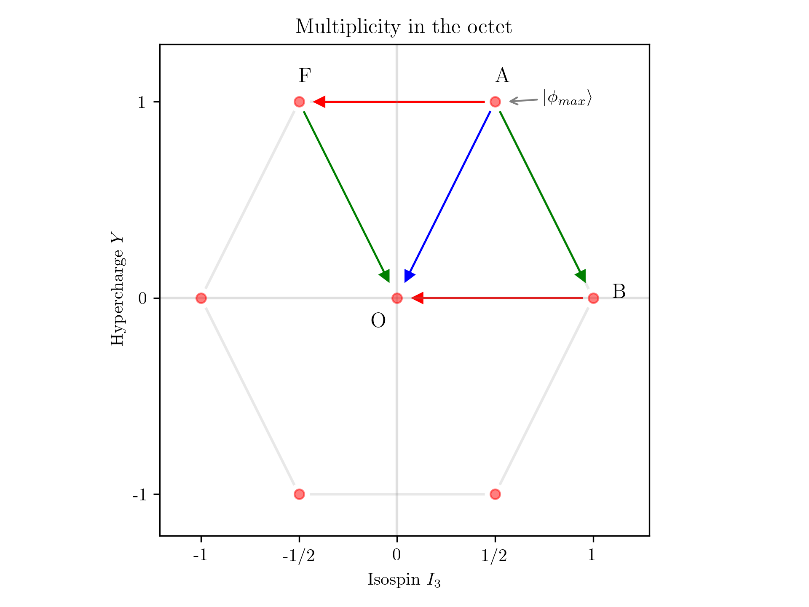
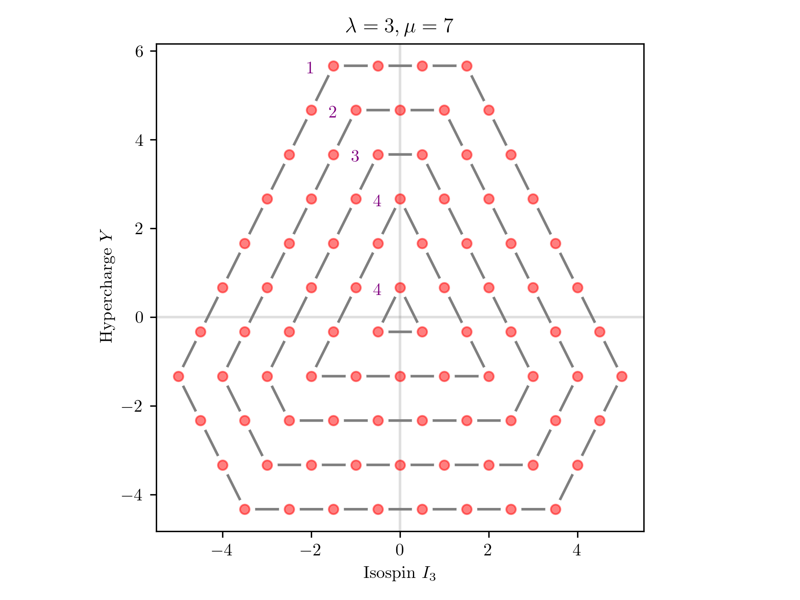

# SU(3) Multiplets

$SU(3)$ is a very important group in physics. This project generates visualisations for its multiplets.

## What is SU(3)?

$SU(3)$ stands for the **special unitary group of degree 3**.

It is a Lie group, which means that its generators form a Lie algebra. In the defining representation, these are the so-called [Gell-Mann matrices](https://en.wikipedia.org/wiki/Gell-Mann_matrices): $\lambda_1, ..., \lambda_8$. They can be linearly transformed to nine generators: $I_{+}, I_{-}, I_3, V_{+}, V_{-}, V_3, U_{+}, U_{-}, U_3$.

The subset $I_{+}, I_{-}, I_3$ correspond to *isospin* and satisfy the Lie algebra of $su(2)$. Correspondingly, $V$ and $U$ generate $V$-spin and $U$-spin, respectively. Since $SU(3)$ has 8 generators (not 9), these operators are not linearly independent. This will be important when we reach multiplicity.

## What are multiplets?

The algebra $su(3)$ has two Casimir operators. This means that every irreducible representation can be characterized by two numbers: here we call them $\lambda = 2I_3$ and $\mu = 2U_3$.

Going back to the linear dependence between the generators, we define *hypercharge* as $Y = \frac{2}{3}(U_3 - V_3)$. With this, we can start building a multiplet on the isospin-hypercharge plane. The so-called *maximal vector* will have coordinates $I_3=\frac{\lambda}{2}$ and $Y=\frac{\lambda + 2\mu}{3}$. This point has the maximal value of hypercharge and maximal value of isospin for this value of hypercharge. To get to the *minimal* value of $I_3$, we need to apply the isospin lowering operator $I_-$ $\lambda$ times. This corresponds to moving from point $A$ to $F$ on the diagram below.

After reaching point $F$, we need to move to the direction of increasing $V$-spin, so the direction of $V_+$. This gets us to point $E$, after which we move in the direction of $U_-$ to point $D$ and so on. The whole procedure is explained marvelously in Anthony Zee's book linked below.

| Triplet    | Anti-triplet |
| -------- | ------- |
|   |     |

Some of the most notable multiplets are the triplet ($u, d, s$ quarks) and the anti-triplet ($\bar{u}, \bar{d}, \bar{s}$ quarks). Other multiplets can also be obtained by superimposing these on top of one-another. Combining $3$ and $3$ gives a sextet, while combining $3$ and $\bar{3}$ gives an octet (see the section on multiplicity below):

| Sextet    | Octet    |
| -------- | ------- |
|   |     |

Taking the product $3 \otimes 3 \otimes 3$ we obtain the decuplet.

These multiplets have physical counterparts in mesons and baryons. This classification was named the Eightfold Way by Murray Gell-Mann [2].

## Multiplicity

If at this point you are wondering, how we got to an octet (with 8 states) by superimposing a triplet and an anti-triplet (both with 3 states) on top of one another, you are absolutely right: 3 times 3 *is* 9 (not 8)! The answer is in multiplicity: the central point has two states. One is a member of the octet and the other forms a singlet all by itself. Formally, we write $3 \otimes \bar{3} = 8 \oplus 1$.

This boils down to the fact that there are three ways to get from $A$ to $O$, but (as mentioned above) not all paths are independent. This still leaves us with 2 independent states. For a general multiplet, the outer rim always has one state per point, but the number increases for inner layers. Once we reach triangular structures, this number remains constant all the way down. This is illustrated on the diagram below.

## References

1. ["Group Theory in a Nutshell for Physicists"](https://inspirehep.net/literature/1695330) by *A. Zee*;
2. The [Eightfold Way](https://en.wikipedia.org/wiki/Eightfold_way_(physics)) on Wikipedia.